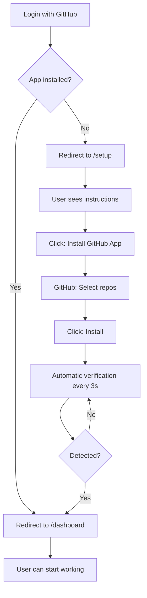

# ⚡ Quick Start - GitHub App Installation

## 🎯 For the Administrator (One-time setup)

### 1. Ensure your GitHub App Name is correct

In your `.env`:
```bash
GITHUB_APP_NAME="broslunas-cms"  # Must be the slug, not the display name
```

**Where to find the slug?**
- Go to: https://github.com/settings/apps
- Click on your app.
- The slug is in the URL: `github.com/settings/apps/[THIS-IS-THE-SLUG]`

---

## 👤 For New Users

### Automatic Flow



### User View

1. **First time (no app)**
   ```
   Login → /setup
   
   Screen shows:
   ┌─────────────────────────────────┐
   │  🐙 Welcome to the CMS!         │
   │                                 │
   │  To get started:                │
   │  1. Install the GitHub App      │
   │  2. Select your repos           │
   │  3. Start working!              │
   │                                 │
   │  [Install GitHub App] →         │
   └─────────────────────────────────┘
   ```

2. **During installation**
   ```
   • Tab opens on GitHub
   • User installs the app
   • User returns to the CMS (original tab)
   • ✨ Automatically redirects to /dashboard
   ```

3. **Subsequent logins**
   ```
   Login → /dashboard (direct)
   
   /setup is no longer shown
   ```

---

## 🔧 Manual Verification

### Testing the flow

```bash
# 1. Start the dev server
npm run dev

# 2. Open in incognito mode
# http://localhost:3000

# 3. Login with a GitHub account that does NOT have the app

# 4. You should see /setup automatically

# 5. Install the app from /setup

# 6. Return to the CMS tab

# 7. In ~3 seconds → Redirects to /dashboard
```

---

## 📋 FAQ

### What happens if the user closes the tab without installing?

They remain on `/setup` and can try again whenever they want.

### How do I verify that the app is installed?

```bash
# On the backend
GET /api/check-installation

# Response:
{
  "installed": true,
  "message": "GitHub App installed correctly"
}
```

### Can I skip /setup?

No, the dashboard verifies `session.appInstalled` and redirects if it is `false`.

### What happens if the user subsequently uninstalls the app?

The next login will detect `appInstalled: false` and send them back to `/setup`.

### Do I need to configure webhooks?

No, 3-second polling is sufficient for a good UX.

---

## 🎨 Personalization

### Adjusting the verification interval

In `components/InstallationChecker.tsx`:

```typescript
// Change from 3000ms (3s) to another value
const interval = setInterval(async () => {
  // ...
}, 3000); // ← Change here
```

### Personalizing the setup message

In `app/setup/page.tsx`, edit the content of `CardHeader` and `CardContent`.

---

## ✅ Production Checklist

Before going live:

- [ ] `GITHUB_APP_NAME` is correctly configured.
- [ ] The GitHub App has permissions: **Contents: Read & Write**.
- [ ] The GitHub App is published (not in draft mode).
- [ ] `NEXTAUTH_URL` points to your production domain.
- [ ] `NEXTAUTH_SECRET` is different from the development one.
- [ ] You have tested the complete flow in a staging environment.

---

## 🚀 Deploy

Necessary environment variables in production:

```bash
# MongoDB
MONGODB_URI=your-mongodb-uri

# NextAuth
NEXTAUTH_URL=https://your-domain.com
NEXTAUTH_SECRET=your-secure-secret

# GitHub App
GITHUB_ID=your-client-id
GITHUB_SECRET=your-client-secret
GITHUB_APP_NAME=your-app-slug
```

---

**Success!** The CMS now explicitly requires users to install the GitHub App before they can manage content. 🎉
